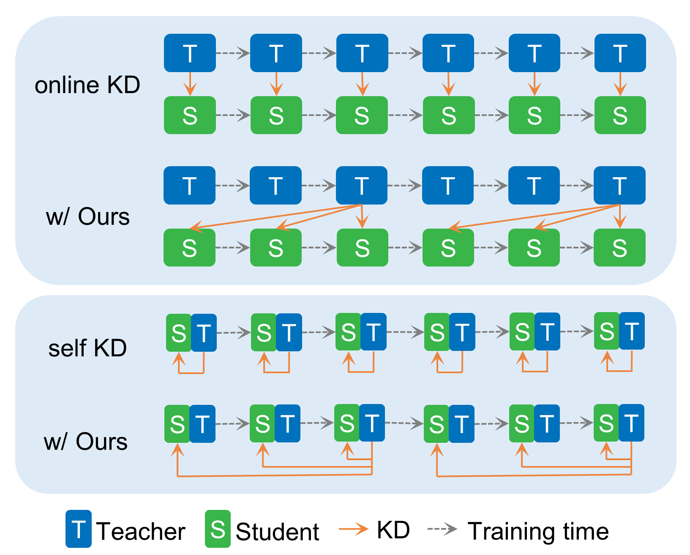

<div align="center">
  
  <div>
  <h1>Right Time to Learn: Promoting Generalization via Bio-inspired Spacing Effect in Knowledge Distillation</h1>
  </div>

  <div>
      Guanglong Sun, Hongwei Yan, Liyuan Wang, Qian Li, Bo Lei and Yi Zhong
  </div>

  <div>
      <h4>
          ICML 2025
      </h4>
  </div>
  <br/>

</div>


Official PyTorch implementation of our paper for Spaced Knowledge Distillation (Spaced KD) (ICML 2025).

Our proposed **Spaced KD** is an accessible and compatible strategy to improve the effectiveness of both online KD and self KD, in which the student model distills knowledge from a teacher model trained with a space interval ahead. This strategy is inspired by a prominent theory named **spacing effect** in biological learning and memory, positing that appropriate intervals between learning trials can significantly enhance learning performance.

From our experiments, the space interval s is relatively insensitive and s = 1.5, s = 4.0 results in consistently strong improvements in Online KD and Self KD, respectively.




## How to run Spaced KD?

## Requirements
Install the required packages. 

This is my experiment eviroument
- python 3.9.18
- torch 2.4.1+cu121
- torchvision 0.19.1+cu121
- wandb 0.16.3(optional)

```sh
pip install -r requirements.txt
```

### For Spaced Online KD (CNN-based models)

To train a CNN-based models with spaced online KD, please run:
  ```sh
    cd ./onlineKD
    python ./train_space.py \
        -gpu_ids  '0' \
        -wandb_entity [your_wandb_entity] \
        -wandb_project [your_wandb_project] \
        -net_teacher 'resnet18' \
        -net_student 'resnet18' \
        -alpha 0.3 \
        -temp 3.0 \
        -lr 0.01 \
        -interval_rate 1.5 \
        -b 128 \
        -gpu \
        -dataset 'cifar100'
  ```

### For Spaced Self KD (CNN-based models)

To train a CNN-based models with spaced self KD, please run:
  ```sh
    cd ./selfKD
    python ./train.py \
    --gpu_ids  '0' \
    --wandb_entity [your_wandb_entity] \
    --wandb_project SKD \
    --model 'resnet18' \
    --interval_rate 4.0 \
    --dataset 'cifar100'
  ```


### For Spaced KD in transformer-based architecture


To train a transformer-based models with spaced KD, please run:
    
   1. Train from scratch (base model) of DeiT-Tiny over CIFAR-100
   
       ```sh
       python run_net.py --mode train --cfg configs/deit/deit-ti_c100_base.yaml
       ```
   
   2. Train naive online KD of DeiT-Tiny over CIFAR-100
   
       ```sh
       python run_net.py --mode train --cfg configs/deit/deit-ti_c100_online.yaml
       ```
   
   3. Train Spaced KD of DeiT-Tiny over CIFAR-100
   
       ```sh
       python run_net.py --mode train --cfg configs/deit/deit-ti_c100_space_1_5.yaml
       ```

Configs of experiments of different ViT architectures and datasets are listed in `vit/configs`


## Acknowlegment
This implementation is developed based on the source code of [self-KD](https://github.com/ArchipLab-LinfengZhang/pytorch-self-distillation-final) and [tiny-transformer](tiny-transformers).

## CITATION
If you find our codes or paper useful, please consider giving us a star or citing our work.

```bibtex
@misc{sun2025righttimelearnpromotinggeneralization,
      title={Right Time to Learn:Promoting Generalization via Bio-inspired Spacing Effect in Knowledge Distillation}, 
      author={Guanglong Sun and Hongwei Yan and Liyuan Wang and Qian Li and Bo Lei and Yi Zhong},
      year={2025},
      eprint={2502.06192},
      archivePrefix={arXiv},
      primaryClass={cs.LG},
      url={https://arxiv.org/abs/2502.06192}, 
}
